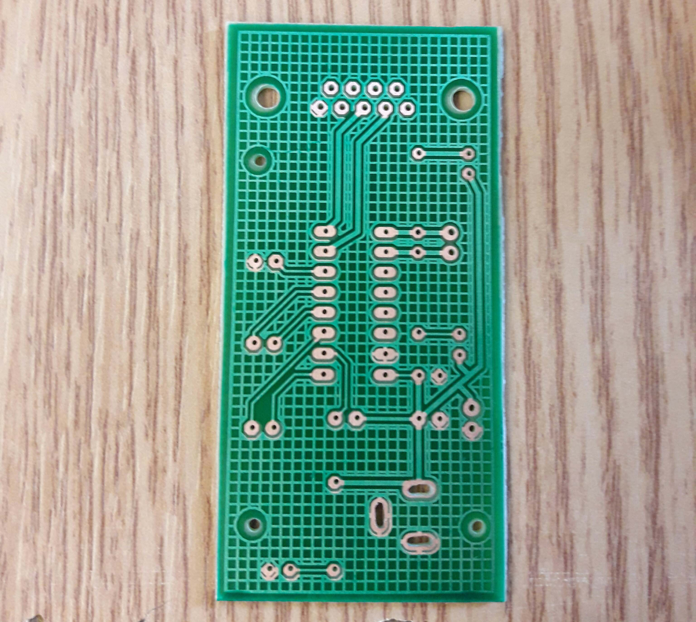
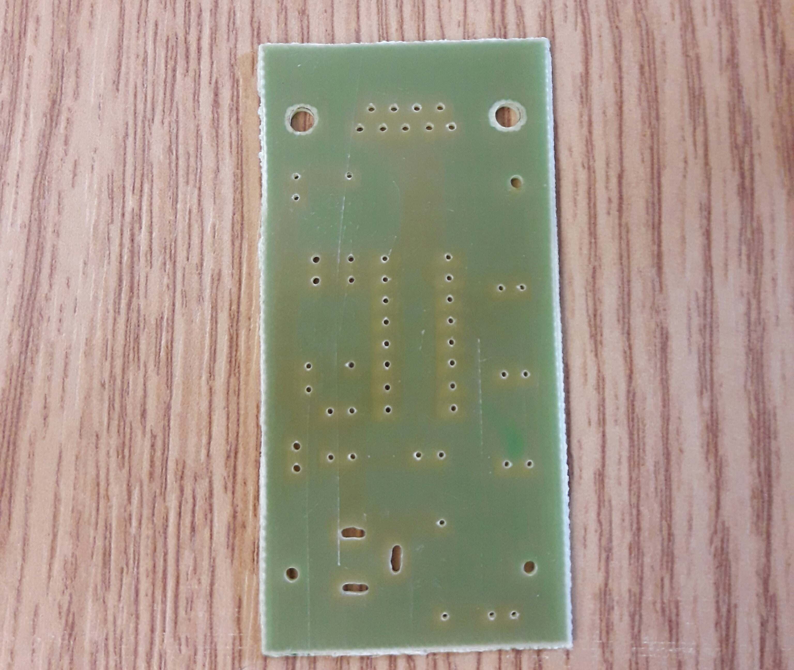
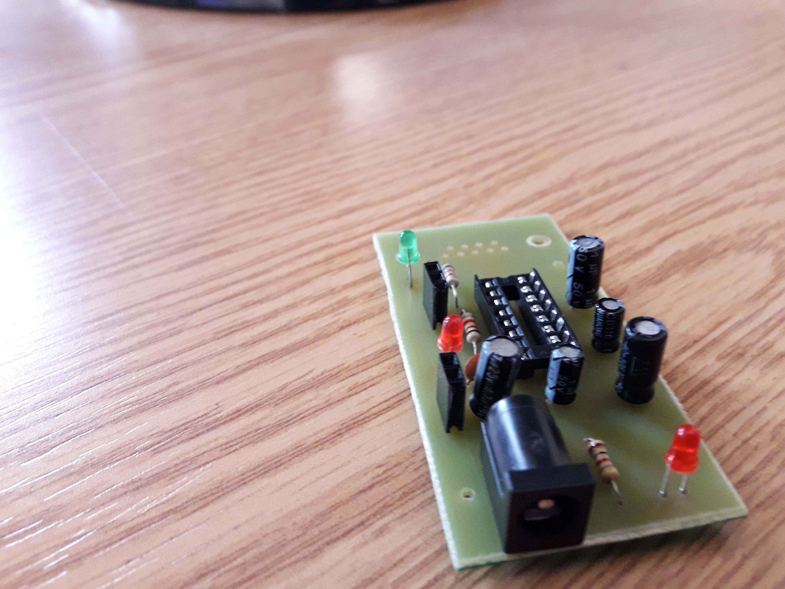
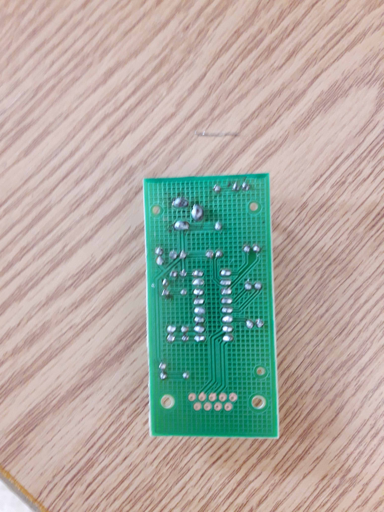
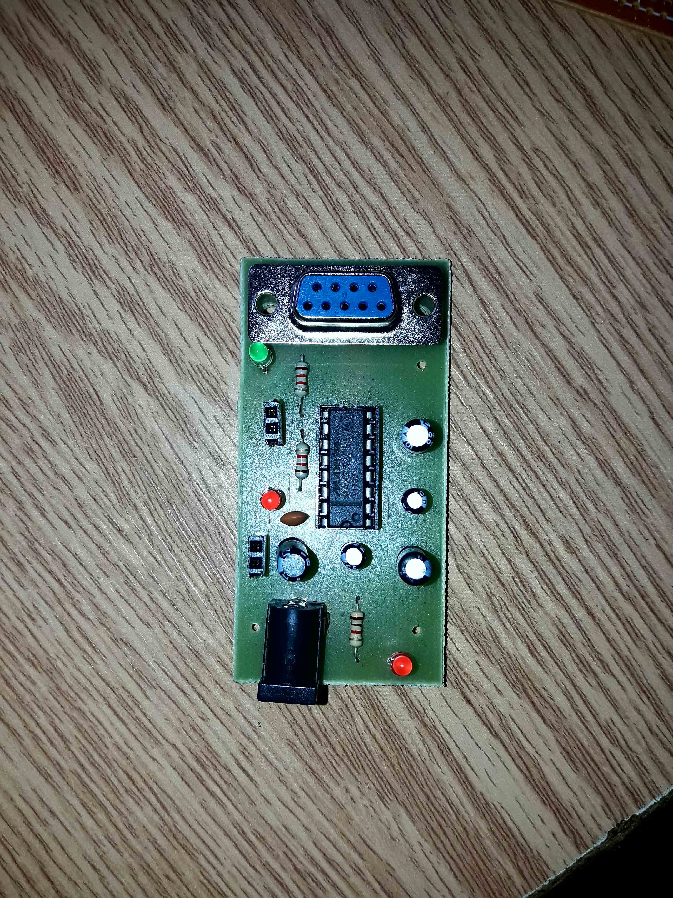

# Implementation Folder

## Overview
This folder contains documentation and resources related to the physical implementation and testing of the MAX232 PCB. The files in this folder will guide you through assembling, soldering, and testing the components on the fabricated PCB to ensure proper functionality of the MAX232 circuit.

## Implementation Steps

### 1. PCB Fabrication

  
  

Before starting the implementation, ensure that the PCB is fabricated using the Gerber files located in the [PCB Design](../pcb_design) folder. The board should be fabricated and ready for component assembly.

### 2. Component Assembly

  
  

This includes:
- **Soldering the Components**: Instructions on how to solder the MAX232 IC, capacitors, DB9 connector, resistors, LEDs, and other components.
- **Component Placement**: Visual references showing where each component should be placed on the board.
- **Best Practices**: Tips for effective soldering and avoiding common mistakes during assembly.

### 3. Testing the Assembled PCB
This includes:
- **Power Test**: Verifying the correct voltage supply to the MAX232 IC.
- **RS-232 to TTL Conversion Test**: Testing the data transmission between the RS-232 interface and the TTL logic.
- **Debugging Tips**: Steps to follow if the circuit does not work as expected.

### 4. Final Integration

  
 

After successful testing, the PCB can be integrated into larger systems or enclosures. 

## Related Files
- The PCB design and schematic can be found in the [schematic](../schematics) and [pcb_design](../pcb_design) folders.
- The Bill of Materials (BOM) for component details is available in the main project's README file.

---

This folder is essential for those building and testing the MAX232 PCB. Make sure to carefully follow the assembly and testing steps to ensure the circuit functions correctly.
