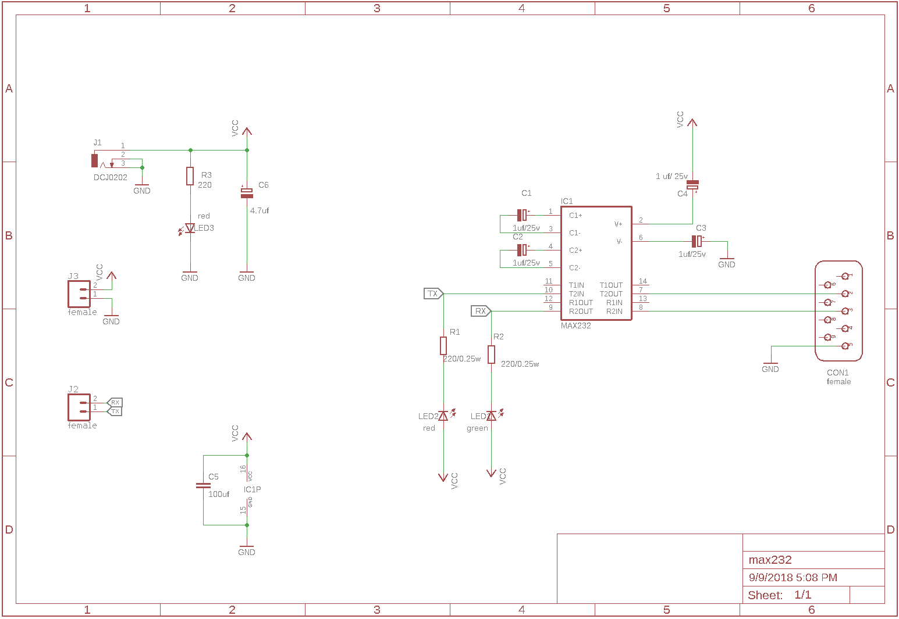

# Schematics Folder

## Overview
This folder contains the schematic design files for the MAX232 PCB project. The schematic is the foundation of the circuit, detailing how each component is connected to the MAX232 IC, including the RS-232 interface, power supply, and TTL logic.

## Files in This Folder
- **max232.sch**: The primary schematic file created in Eagle. This file contains the detailed connections for all components.
- **max232.png**: A high-resolution image of the schematic for quick reference.
  
  > **Note:** The `.sch` file can be opened with Eagle PCB design software or compatible tools.

## Schematic Overview
The schematic includes the following main components:
- **MAX232 IC**: Converts RS-232 signals to TTL logic levels.
- **Capacitors**: Five 0.1µF capacitors are used for voltage conversion required by the MAX232 IC.
- **RS-232 Interface (DB9 Connector)**: Allows connection to an external serial device.
- **TTL Logic Connections**: Connects to external digital logic circuitry.
- **Power Supply**: The schematic provides a 5V input to power the IC and other components.

## Related Files
- The PCB layout, corresponding to this schematic, can be found in the [PCB Design](../pcb_design) folder.
- The Bill of Materials (BOM) and component details can be found in the main project’s README file.

---

This folder is crucial for understanding how the electrical connections in the MAX232 PCB design work. Make sure to review the schematic before working on the PCB design or assembly.
